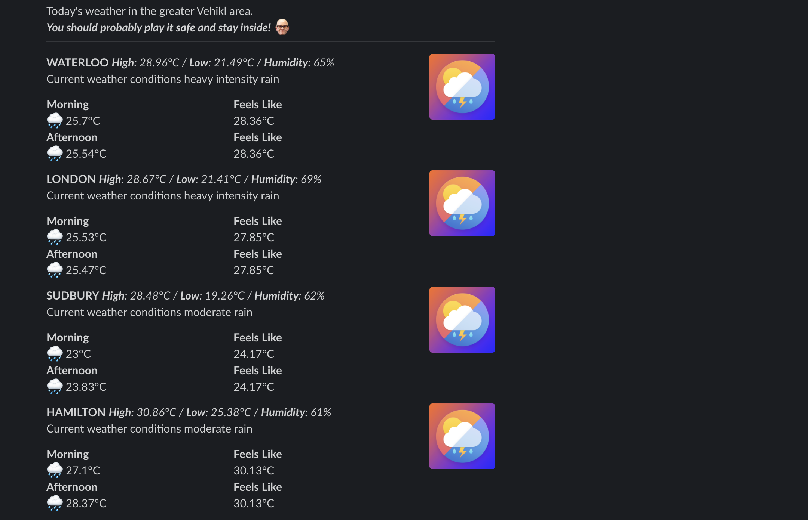

# Weather Slack Bot 🤖

Using [Netlify Functions](https://docs.netlify.com/functions/overview/) it will grab the current weather and post them to Slack. Styled with their [Block Kit](https://api.slack.com/block-kit) component structure.

## Weather Function
Will accept a city that gets passed into a slash command and print the current weather temperature and weather conditions. 

## Scheduled Weather Function
Will grab the current weather and daily forecast for London, Waterloo, Hamilton and Sudbury.

## Preview

  

